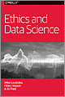

# Ethics and Data Science
## By Mike Loukides, Hilary Mason, and DJ Patil
	  

	  
As the impact of data science continues to grow on society, there is an increased need to discuss how data is appropriately used and how to address misuse. Yet, ethical principles for working with data have been available for decades. The real issue today is how to put those principles into action. With this report, authors Mike Loukides, Hilary Mason, and DJ Patil examine practical ways for making ethical data standards part of your work every day.

To help you consider all of possible ramifications of your work on data projects, this report includes:

* A sample checklist that you can adapt for your own procedures
* Five framing guidelines (the Five C’s) for building data products: consent, clarity, consistency, control, and consequences
* Suggestions for building ethics into your data-driven culture

Now is the time to invest in a deliberate practice of data ethics, for better products, better teams, and better outcomes. Read a copy of this report and learn what it takes to do good data science today.

[Preface](preface.md)

[1. Doing Good Data Science](doing_good_data_science.md)

[2. Of Oaths and Checklists](of_oaths_and_checklists.md)

[3. The Five Cs](the_five_cs.md)

[4. Data's Day of Reckoning](datas_day_of_reckoning.md)

[5. Case Studies](casestudies.md)

---

**Original Repository:** [Ethics and Data Science](https://resources.oreilly.com/examples/0636920203964)

**Author:** O'Reilly Media, Inc.

**Forked Repository:** [Ethics](github.com/jasonkronemeyer/ethics

**Modifications:** [Brief description of the changes or additions you have made]

**Date of Fork:** March 1, 2022
